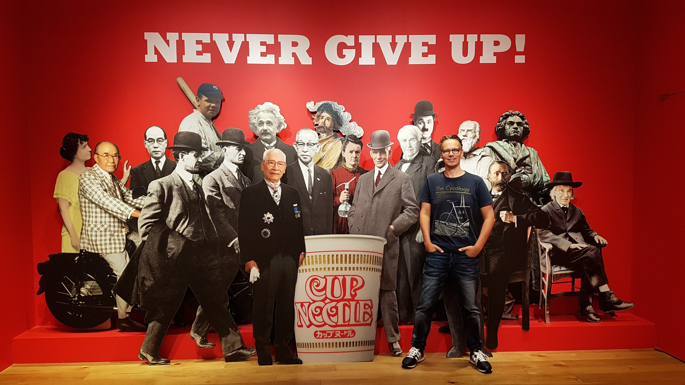

<!-- Global style -->
<style>
section {
  font-size: 32px;
}

</style>


<br>
<br>
<br>

## <!--fit--> **GitHub runners for a few cents**

#### **Niek Palm**

---

# Niek Palm

- Philips | Principal Engineer

- Hands-on | Open Source

- AWS | IaC | TypeScript

- Travel | Home Cook | Triathlon



---

# Scott Guymer

- Philips | Principal Engineer

- Hands-on | Open Source

- AWS | Azure | C# | TypeScript

- Ice Hockey


---

## <!--fit--> A brief history

🏛️ March 2020

👨🏽‍💻 InnerSource the new Default

✨ Source Code -> GitHub

🔌 Empower everyone with Actions


---

# 101 - InnerSource

InnerSource is a development methodology where engineers build proprietary software using best practices from large-scale open source projects.


---

# 101 - GitHub Actions

- Actions == GitHub CI/CD ++
- Actions == CI/CD Lego bricks
- Jobs are triggered by an event
- Jobs require a runner to run

```yaml
on: [push]
jobs:
  check-bats-version:
    runs-on: [self-hosted]
    container: node:16
    steps:
      - uses: actions/checkout@v3
      - run: npm install -g bats
      - run: bats -v
```


---

# <!-- fit --> 🏗️ What do we need for CI/CD?

---

# <!-- fit --> 🔌 Connection


---

# <!-- fit --> ↔️ Scale


---

# <!-- fit --> 💰 Costs


---

slide sustainable? Easy to maintain?

---

<!-- markdownlint-disable MD033 -->
<style scoped>

h1 {
  font-size: 80px
}

section {
  font-size: 28px;
}

</style>

# 💡 Idea

- Run on standard Linux VMs
- Scale in/ou based on workload
- Run in cloud connected to premise
- Support repo and org level runners
- Develop open source from day 0
- Apply all standard practices


---

<style scoped>

h1 {
  color: green;
  font-size: 90px;
  font-family: fantasy;
  text-align: center;
}

h2 {
  color: blue;
  font-size: 50px;
  text-align: center;
  font-family: fantasy;
}

</style>

## Pay only for usage

## Scaling to zero

# SERVERLESS

## Event based

## Treat runners as cattle

---

---

# <!-- fit --> 🤔 How do up?

<br><br>

💡 Listen for workflow job event

💡 Scale potential for any event

💡 Condition to prevent scaling


---

# <!-- fit --> 🤔 How do we scale down?

<br><br>

⚠️ No event

⚠️ No queue, or API to check

💡 Scheduled task


---

# <!-- fit --> 🤔 Costs & Sustaible?

<br><br>

💡 Lambda and API Gateway

💡 Scale down when possible

💡 Low cost on maintenance

💡 Low cost on fire fighting


---

<style scoped>
section {
  font-size: 28px;
}
</style>

## Cloud Architecture

- GitHub App for events
- AWS API gateway to get events
- AWS Lambda for event handling
- AWS SQS for decoupling
- AWS Lambda to scale up
- GitHub App for API access
- AWS EC2 (Spot) to run jobs
- AWS Direct connect for networking
- AWS Lambda for scaling down


---

# demo

<!-- niek -->

---

# ephemeral

<!-- niek -->

---

# open source development

- releases
- automations
- ***

# open source contribution

- security
- gov cloud
- windows

---

# Usage in Philips

---

# How we deploy

<!--
- pipelines
- terraform / terragrunt
- checks
- codeowners for security officer..
-->

---

```hcl

module "github-runner" {
  source  = "philips-labs/github-runner/aws"

  aws_region  = "eu-west-1"
  vpc_id     = "vpc-123"
  subnet_ids = ["subnet-123", "subnet-456"]

  github_app = {
    key_base64     = "secret"
    id             = "1"
    webhook_secret = "webhook_secret"
  }

  enable_organization_runners = true
}
```
