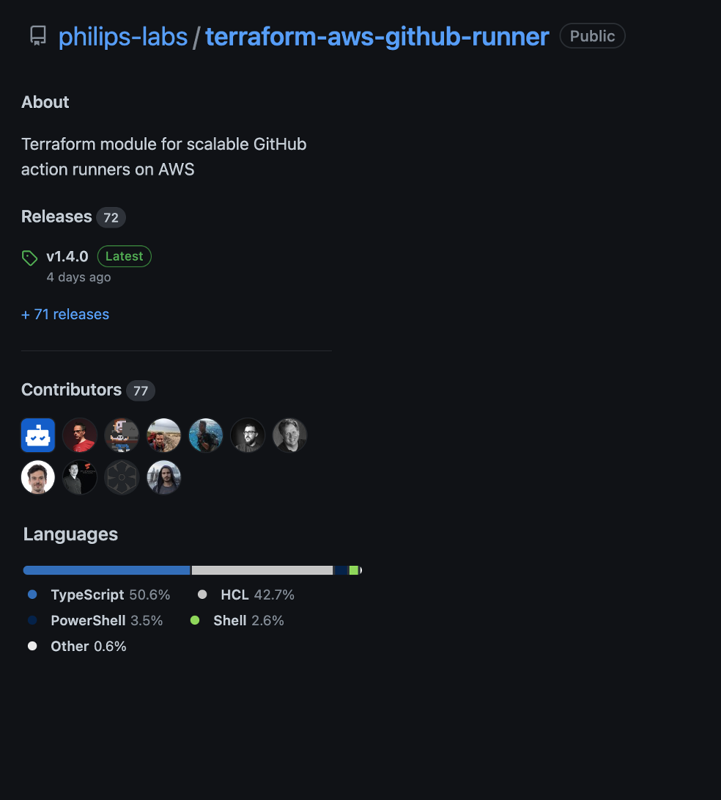

<!-- Global style -->
<style>
section {
  font-size: 32px;
}

</style>


<br>
<br>
<br>

## <!--fit--> **GitHub runners for a few cents**

#### **Scott Guymer / Niek Palm**

---

# Niek Palm

- Philips | Principal Engineer

- Hands-on | Open Source

- AWS | IaC | TypeScript

- Travel | Home Cook | Triathlon


---

# Scott Guymer

- Philips | Principal Engineer

- Hands-on | Open Source

- AWS | Azure | C# | TypeScript

- Ice Hockey


---

<!--
_backgroundColor: blue
_color: white
-->

# What do you know about Philips?


---

<!--
_backgroundColor: blue
_color: white
-->

## We're a **health technology** company improving people's health and well-being through meaningful innovation

## Our purpose is to improve people’s health and well-being. We aim to improve 2.5 billion lives per year by 2030


---

<!--
_backgroundColor: blue
_color: white
-->

# Vision

## To make Philips the best software company in Healthcare

- Leverage best tools
- Change the way collaborate


---

<!--
_backgroundColor: blue
_color: white
-->

<style scoped>

section {
  font-size: 27px
}
</style>

# Software in Philips

- Global

- Embedded | Cloud | Web | Mobile | ?

- 6500+ Software Professionals

- 100 Million lines of code

- Legacy + Green field

- Which langes do we not use?

- Regulated


---

# InnerSource

* InnerSource is a development methodology where engineers build proprietary software using best practices from large-scale open source projects.

* In Phiips we combine world class tools to enable teams to focus on meaningfull inovation to improve people lives.


---

## <!--fit--> How we started?

🏛️ March 2020

👨🏽‍💻 InnerSource the new Default

✨ Source Code -> GitHub

🔌 Empower everyone CI/CD


---

# 101 - GitHub Actions

- Actions == GitHub CI/CD ++
- Actions == CI/CD Lego bricks
- Jobs are triggered by an event
- Jobs require a runner to run

```yaml
on: [push]
jobs:
  check-bats-version:
    runs-on: [self-hosted]
    container: node:16
    steps:
      - uses: actions/checkout@v3
      - run: npx bats -v
```


---

# <!-- fit --> 🏗️ What do we need run actions on scale?

---

# <!-- fit --> 🔌 Connection


---

# <!-- fit --> ↔️ Scale


---

# <!-- fit --> 💰 Costs


---

# <!-- fit --> 🪴 Sustainable


---

<!-- markdownlint-disable MD033 -->
<style scoped>

h1 {
  font-size: 80px
}

section {
  font-size: 28px;
}

</style>

# 💡 Idea

* Run on standard Linux VMs
* Scale in/ou based on workload
* Run in cloud connected to premise
* Support repo and org level runners
* Develop open source from day zero
* Apply all standard practices


---

<!-- <style scoped>

h1 {
  color: green;
  font-size: 90px;
  font-family: fantasy;
  text-align: center;
}

h2 {
  color: blue;
  font-size: 50px;
  text-align: center;
  font-family: fantasy;
}

</style>

## Pay only for usage

## Scaling to zero

# SERVERLESS

## Event based

## Treat runners as cattle -->


---

# <!-- fit --> 🤔 Scale up?

<br><br>

💡 Listen for workflow job event

💡 Scale potential for any event

💡 Condition to prevent scaling


---

# <!-- fit --> 🤔 Scale down?

<br><br>

⚠️ No event

⚠️ No queue, or API to check

💡 Scheduled task


---

# <!-- fit --> 🤔 Costs & Sustainable?

<br><br>

💡 Serverless

💡 Scale down when possible

💡 Low cost on maintenance

💡 Treat runners as a cattle


---

<style scoped>
section {
  font-size: 28px;
}
</style>

## Cloud Architecture

* GitHub App for events
* AWS API gateway to get events
* AWS Lambda for event handling
* AWS SQS for decoupling
* AWS Lambda to scale up
* GitHub App for API access
* AWS EC2 (Spot) to run jobs
* AWS Direct connect for networking
* AWS Lambda for scaling down


---

# <!-- fit --> 📢 LIVE DEMO

* Create cloud resources
* Connect cloud with GitHub
* Run oughly 40 jobs


---
# Security

* Ephemeral
* Encrypted secrets
* Minimal privilleges
* Permission boundaries


---

# Open Source

⭐ 900+ stars

✨ 75+ contributors

❤️ 330+ Pull requests

🏆 Recommended by GitHub




---

# Contribution

* Support windows
* Support ARM
* Better docs
* More Secure
* Upgrades


---

# OS

topics we could cover

- PR checks automated
- Auomated release
- Slack
- Build a community


---

# Usage in Philips

---

# How we deploy

<!--
- pipelines
- terraform / terragrunt
- checks
- codeowners for security officer..
-->

---

```hcl

module "github-runner" {
  source  = "philips-labs/github-runner/aws"

  aws_region  = "eu-west-1"
  vpc_id     = "vpc-123"
  subnet_ids = ["subnet-123", "subnet-456"]

  github_app = {
    key_base64     = "secret"
    id             = "1"
    webhook_secret = "webhook_secret"
  }

  enable_organization_runners = true
}
```
