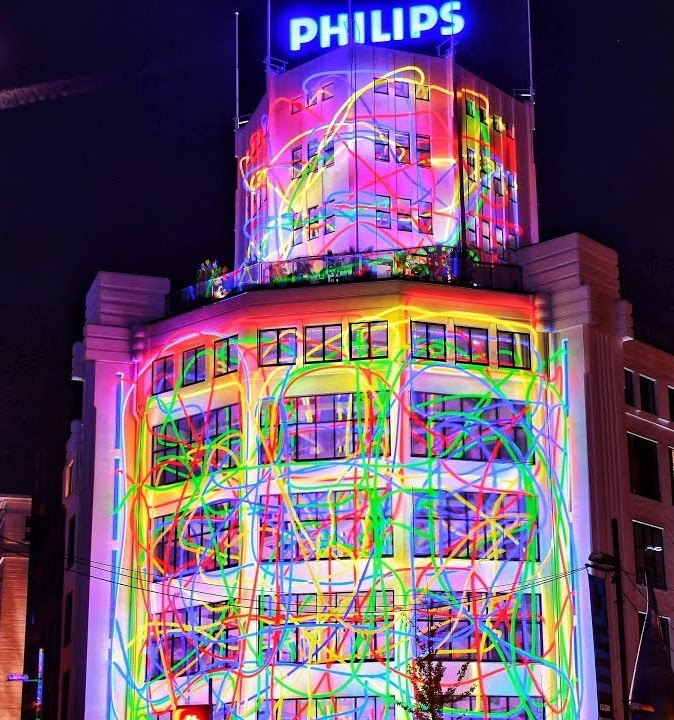

<style scoped>
  h1 {
    background-color: rgba(0, 50, 93, 0.7);
    padding: 10px;
  }
</style>

# <!--fit--> GitHub runners for a **few cents**

## Scott Guymer / Niek Palm


---

<!--
_backgroundColor: #6D1E4A
_color: white
-->

# Niek Palm

🏢 Philips | Principal Engineer

🐦 @niekos77

🌍 040code.github.io

❤️ Travel | Home Cook | Triathlon


---

<!--
_backgroundColor: #3D0F58
_color: white
-->
# Scott Guymer

🏢 Philips | Principal Engineer

🐦 @mr_scottguymer

🌍 www.scottguymer.co.uk


---

<!--
_backgroundColor: #002C77
_color: white
-->

# How do you picture Philips?


<!--
@scott
What are we doing here?
Philips is a worldwide recognisable brand almost everyone in the world has heard of Philips.
But you don't think of software.
How do you picture philips?
-->

---
<!--
_backgroundColor: #00629F
_color: white
-->


# Probably this?

<!-- @scott -->
---

<!--
_backgroundColor: white
_color: #0072DA
-->


# Maybe this?

<!-- @scott -->

---

# <!-- fit --> Not this


<!--
_backgroundColor: #0072DA
_color: white
-->

<!-- @scott -->

---

<!--
_backgroundColor: #0072DA
_color: white
-->

## Philips is a **health technology** company improving people's health and well-being through meaningful innovation

## Our purpose is to improve people’s health and well-being. We aim to improve 2.5 billion lives per year by 2030


<!-- @scott -->
---

<!--
_backgroundColor: #0072DA
_color: white
-->

# Software in Philips

- Global Organisation

- Embedded | Cloud | Web | Mobile

- 6500+ Software Professionals

- 100s Millions lines of code

- Regulated Medical Software


<!-- 
@scott
We build a lot of software in philips
We have a lot of different business units that historically have little alignment
 -->

---

<!--
_backgroundColor: #D10077
_color: #EABEDB
-->

# InnerSource Journey

InnerSource is a development methodology where engineers build proprietary software using best practices from large-scale open source projects.


<!-- 
@Niek

InnerSource is key to our software strategy

In Philips we combine world class tools to enable teams to focus on meaningful innovation to improve people lives.
 -->

---

<!--
_backgroundColor: #269A91
_color: #244C5D
-->

## <!--fit--> How we started?

🏛️ March 2020

👨🏽‍💻 InnerSource the new default

✨ Driven by GitHub

🔌 Empower everyone with CI/CD


<!-- @niek -->

---

<!--
_backgroundColor: #0072DA
_color: #93C2F8
-->

# 101 - GitHub Actions

- Actions == GitHub CI/CD ++
- Actions == CI/CD Lego bricks
- Jobs are triggered by an event
- Jobs require a runner to run

```yaml
on: [push]
jobs:
  check-bats-version:
    runs-on: [self-hosted]
    container: node:16
    steps:
      - uses: actions/checkout@v3
      - run: npx bats -v
```


<!-- @niek -->

---

# <!-- fit --> Why do we need

# <!-- fit --> self hosted GitHub  runners?


<!-- 
@scott
Ideally we would use the public runners - but we cant because 
-->

---

<!--
_backgroundColor: #269A91
_color: #244C5D
-->

# <!-- fit --> 🔌 Connectivity


<!-- @scott -->
---

<!--
_backgroundColor:  #BE5500
_color: #FDD37A
-->

# <!-- fit --> 💰 Costs


<!-- @scott -->

---

<!--
_backgroundColor: #008540
_color: #144835
-->

# <!-- fit --> 🔐 Security


<!-- @scott -->

---

<!--
_backgroundColor: #002C77
_color: #93C2F8
-->

# <!-- fit --> 💡 Requirements

- Run on standard Linux VMs
- Option to tailor (OS / Arch)
- Scale up / down / zero
- Connect to private services
- Only pay for what's used


<!-- @niek -->

---

<!--
_backgroundColor: #D10077
_color: #6D1E4A
-->

<style scoped>
h2 {
  text-align: center;
  font-size: 75px;
  color:  #FABCDB;
}
</style>

# <!-- fit --> Event based

## Scale based on workflow jobs

<!-- @niek -->

---

<!--
_backgroundColor: #008540
_color: #144835
-->

<style scoped>
h2 {
  text-align: center;
  font-size: 62px;
  color: #A0DABB;
}
</style>

# <!-- fit --> Serverless

## low cost / low maintenance control plane

<!-- @niek -->

---

<!--
_backgroundColor: #269A91
_color: #244C5D
-->

<style scoped>
h2 {
  text-align: center;
  font-size: 75px;
  color: #7EDDDE;
}
</style>

# <!-- fit --> Treat as Cattle

## Secure and no fire fighting

<!-- @niek -->

---

<!--
_backgroundColor: #DE7C00
_color: #9B3426
-->

<style scoped>
h2 {
  text-align: center;
  font-size: 75px;
  color: #FDD37A;
}
</style>

# <!-- fit --> Networking

## Bring your own connection

<!-- 
@niek 
Connectivity is abstract of the end solution. You bring the solution to your network and take advantage of it 
-->

---

<!--
_backgroundColor: #269A91
_color: #244C5D
-->

<style scoped>
section {
  font-size: 28px;
}
</style>

## Cloud Architecture

* GitHub App for events
* AWS API gateway to get events
* AWS Lambda for event handling
* AWS SQS for decoupling
* AWS Lambda to scale up
* GitHub App for API access
* AWS EC2 (Spot) to run jobs
* AWS Direct connect for networking
* AWS Lambda for scaling down


<!-- @niek -->

---

# <!-- fit --> 📢 DEMO

* Create cloud resources
* Connect cloud with GitHub
* Run 40 jobs


<!-- @niek -->

---

<!--
_backgroundColor: #0072DA
_color: #002C77
-->

# Security

* Ephemeral
* Encrypted secrets
* Minimal privileges
* Permission boundaries


<!-- @scott -->
---

<!--
_backgroundColor: #269A91
_color: #244C5D
-->

# Open Source

⭐ 900+ stars

✨ 75+ contributors

❤️ 330+ Pull requests

🏆 Recommended by GitHub


<!-- 
@niek 
topics we could cover

- PR checks automated
- Automated release
- Slack
- Build a community
 -->

---

<!--
_backgroundColor: #008540
_color: #144835
-->

# Contribution

- Support windows
- Support ARM
- Support GHES
- Better docs
- Security improvements
- Upgrades


<!-- @niek -->
---

<!--
_backgroundColor: #DE7C00
_color: #9B3426
-->

# <!-- fit --> Running at Scale

# <!-- fit --> in Philips



<!-- @niek -->

---

<!--
_backgroundColor: #8345BA
_color: #3D0F58
-->

# Deployment

* Deploy runners with the runners
* Terragrunt to keep our Terraform dry
* Connect to Philips with AWS Direct Connect
* Network rules controlled via PR and CODEOWNERS


<!-- @niek -->

---

<!--
_backgroundColor: black
_color: white
-->

# <!-- fit --> Self service via IssueOps 


<!-- @niek -->
---

<!--
_color: white
-->

# <!-- fit --> Scaling in and out 


<!-- @niek -->
---
<!--
_color: white
-->

<style scoped>
  h1 {
    background-color: rgba(0, 50, 93, 0.7);
    padding: 10px;
  }
</style>

# <!-- fit --> 10K instances on a average day


<!--
@niek
runners last 3 months per day 
-->

---

# Problems


<!-- @Scott -->

---

<!--
_backgroundColor:  #002C77
_color: #93C2F8
-->

# CI DOS


<!-- @Scott -->

---

# Rate Limits


<!-- @Scott -->

---

# Costs


<!-- @Scott -->
---

<!--
_backgroundColor: #3D0F58
_color: white
-->

# <!-- fit --> 💸 How much?


<!-- 
@scott
We service a GH org with more than 4k engineers and over 6k repositories
 -->

---

<!--
_backgroundColor:  #002C77
_color: #93C2F8
-->

# <!-- fit --> 30 to 40 cents per developer per month

<!-- @scott -->
---
# Questions

<style scoped>
section {
  font-size: 70px;
}
</style>


---
<!--
_backgroundColor: black
-->

```hcl
# Resources

resource "website" "github" {
  url = "github.com/philips-labs/terraform-aws-github-runner"
}

resource "website" "slides" {
  url = "github.com/philips-labs/2022-07-07_scaling-github-runners"
}

resource "contact" "niek" {
  github   = "@npalm"
  linkedin = "in/niekpalm/"
  twitter  = "@niekos77"
}

resource "contact" "scott" {
  github   = "@ScottGuyme"
  linkedin = "in/scottguymer/"
  twitter  = "@mr_scottguymer"
}

```
